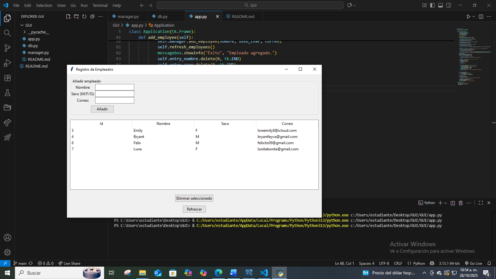
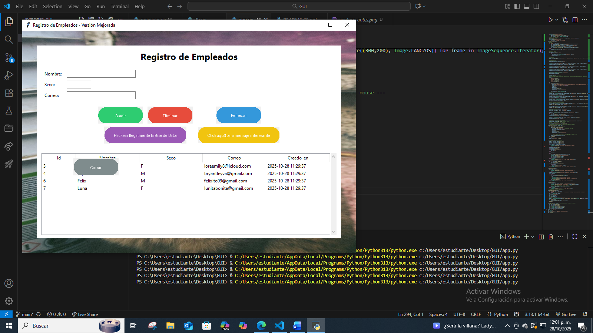

# Sistema de Registro de Empleados en Python - Versión Mejorada (Ejercicio 14)

🔹 **Descripción del Proyecto**

Este proyecto es una evolución del sistema de registro de empleados desarrollado previamente (Ejercicio 13), implementando mejoras en la interfaz gráfica y nuevas funcionalidades, manteniendo la conexión segura con la base de datos MySQL. El sistema sigue utilizando Python y Tkinter, aplicando Programación Orientada a Objetos (POO) para mantener un código modular, limpio y escalable.

Las mejoras incluyen:
- Personalización visual de la interfaz (fondos, tipografía, colores y animaciones en botones).
- Nuevas funciones interactivas y lúdicas.
- Exportación de datos a CSV.
- Reorganización de elementos en la interfaz para mejor experiencia de usuario.

🔹 **Estructura del Proyecto**

GUI/
│__ saludo.gif
├── app.py                       # Interfaz gráfica principal con mejoras visuales y funciones nuevas
├── db.py                        # Configuración y conexión con la base de datos MySQL
├── manager.py                   # Lógica de manejo de empleados (agregar, listar, eliminar, exportar CSV)
├── README.md                    # Este archivo
├── captura_antes.png            # Captura de la interfaz anterior (Ejercicio 13)
├── captura_despues.png          # Captura de la interfaz mejorada (Ejercicio 14)
└── background.png


🔹 **Base de Datos**

La base de datos utilizada se llama `empleados_db` y contiene una tabla principal:

**Tabla:** empleados

| id | nombre | sexo | correo |
|----|--------|------|--------|

El campo `id` se genera automáticamente al registrar un nuevo empleado.

🔹 **Capturas de Pantalla Comparativas**

**Versión Anterior (Ejercicio 13):**


**Versión Mejorada (Ejercicio 14):**


🔹 **Nuevas Funcionalidades y Cambios Realizados**

**Diseño y Estilo:**
- Imagen de fondo visible y funcional.
- Colores de botones diferenciados según función.
- Tipografía tipo pixel art para botones.
- Bordes redondeados (45px) y sombreado en hover.
- Reorganización de botones, etiquetas y campos de texto.

**Funciones Nuevas:**
- Botón **"Hackear Ilegalmente la Base de Datos"**: exporta registros a un archivo `.csv`.
- Botón **"Click aquí para mensaje interesante"**: abre ventana "Hola Mundo" con GIF animado.
- Botón **"Cerrar"**: se mueve aleatoriamente evitando ser clicado.

**Base de Datos:**
- Conexión segura a MySQL.
- Uso de sentencias preparadas para evitar inyección SQL.

🔹 **Cómo Ejecutar el Proyecto**

1. **Preparar la Base de Datos**

Abrir MySQL Workbench o la terminal MySQL y ejecutar:

```sql
CREATE DATABASE empleados_db;
USE empleados_db;

CREATE TABLE empleados (
    id INT AUTO_INCREMENT PRIMARY KEY,
    nombre VARCHAR(100),
    sexo VARCHAR(100),
    correo VARCHAR(100)
);
```

2. **Instalar Dependencias**

```bash
pip install mysql-connector-python pillow
```

3. **Configurar la conexión en `db.py`**

```python
return mysql.connector.connect(
    host="localhost",
    user="root",
    password="tu_contraseña",
    database="empleados_db"
)
```

4. **Ejecutar la Aplicación**

```bash
python app.py
```

🔹 **Mejoras respecto a la versión anterior**

- Interfaz gráfica personalizada y más interactiva.
- Nuevos botones con funciones lúdicas y útiles.
- Exportación de registros a CSV.
- Mantenimiento de POO y modularidad.
- Código más legible y documentado.
- Uso de técnicas de seguridad en consultas SQL.
